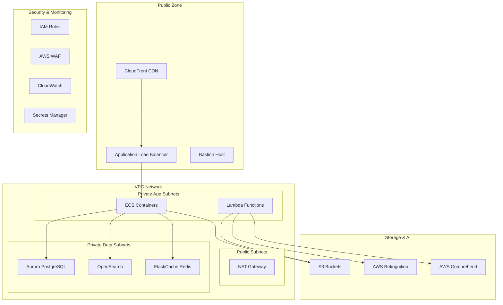
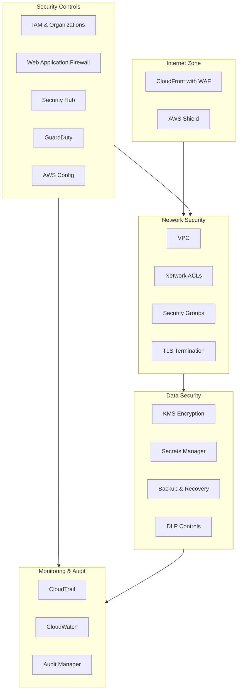

I'll help you set up the AWS infrastructure for your ancestry application. Let's create a secure, scalable cloud environment.




```yaml
AWSTemplateFormatVersion: '2010-09-09'
Description: 'Base infrastructure for Ancestry Application'

Parameters:
  Environment:
    Type: String
    Default: dev
    AllowedValues: [dev, staging, prod]
  
  VpcCIDR:
    Type: String
    Default: 10.0.0.0/16

Resources:
  # VPC Configuration
  VPC:
    Type: AWS::EC2::VPC
    Properties:
      CidrBlock: !Ref VpcCIDR
      EnableDnsHostnames: true
      EnableDnsSupport: true
      Tags:
        - Key: Name
          Value: !Sub ${Environment}-ancestry-vpc

  # Internet Gateway
  InternetGateway:
    Type: AWS::EC2::InternetGateway
    Properties:
      Tags:
        - Key: Name
          Value: !Sub ${Environment}-ancestry-igw

  AttachGateway:
    Type: AWS::EC2::VPCGatewayAttachment
    Properties:
      VpcId: !Ref VPC
      InternetGatewayId: !Ref InternetGateway

  # Public Subnets
  PublicSubnet1:
    Type: AWS::EC2::Subnet
    Properties:
      VpcId: !Ref VPC
      CidrBlock: !Select [0, !Cidr [!Ref VpcCIDR, 6, 8]]
      AvailabilityZone: !Select [0, !GetAZs '']
      MapPublicIpOnLaunch: true
      Tags:
        - Key: Name
          Value: !Sub ${Environment}-public-subnet-1

  PublicSubnet2:
    Type: AWS::EC2::Subnet
    Properties:
      VpcId: !Ref VPC
      CidrBlock: !Select [1, !Cidr [!Ref VpcCIDR, 6, 8]]
      AvailabilityZone: !Select [1, !GetAZs '']
      MapPublicIpOnLaunch: true
      Tags:
        - Key: Name
          Value: !Sub ${Environment}-public-subnet-2

  # Private Subnets
  PrivateSubnet1:
    Type: AWS::EC2::Subnet
    Properties:
      VpcId: !Ref VPC
      CidrBlock: !Select [2, !Cidr [!Ref VpcCIDR, 6, 8]]
      AvailabilityZone: !Select [0, !GetAZs '']
      Tags:
        - Key: Name
          Value: !Sub ${Environment}-private-subnet-1

  PrivateSubnet2:
    Type: AWS::EC2::Subnet
    Properties:
      VpcId: !Ref VPC
      CidrBlock: !Select [3, !Cidr [!Ref VpcCIDR, 6, 8]]
      AvailabilityZone: !Select [1, !GetAZs '']
      Tags:
        - Key: Name
          Value: !Sub ${Environment}-private-subnet-2

  # Security Groups
  ECSSecurityGroup:
    Type: AWS::EC2::SecurityGroup
    Properties:
      GroupDescription: Security group for ECS containers
      VpcId: !Ref VPC
      SecurityGroupIngress:
        - IpProtocol: tcp
          FromPort: 80
          ToPort: 80
          CidrIp: 0.0.0.0/0
        - IpProtocol: tcp
          FromPort: 443
          ToPort: 443
          CidrIp: 0.0.0.0/0

  # S3 Buckets
  MediaBucket:
    Type: AWS::S3::Bucket
    Properties:
      BucketName: !Sub ${Environment}-ancestry-media-${AWS::AccountId}
      PublicAccessBlockConfiguration:
        BlockPublicAcls: true
        BlockPublicPolicy: true
        IgnorePublicAcls: true
        RestrictPublicBuckets: true
      VersioningConfiguration:
        Status: Enabled

Outputs:
  VpcId:
    Description: VPC ID
    Value: !Ref VPC
    Export:
      Name: !Sub ${Environment}-VpcId

  PublicSubnets:
    Description: Public Subnets
    Value: !Join [',', [!Ref PublicSubnet1, !Ref PublicSubnet2]]
    Export:
      Name: !Sub ${Environment}-PublicSubnets

  PrivateSubnets:
    Description: Private Subnets
    Value: !Join [',', [!Ref PrivateSubnet1, !Ref PrivateSubnet2]]
    Export:
      Name: !Sub ${Environment}-PrivateSubnets

```

Let's set up your AWS infrastructure step by step:

1. AWS Account Setup
   - Create an AWS account if you haven't already
   - Set up Multi-Factor Authentication (MFA)
   - Create an IAM user with administrative access
   - Generate and save access keys

2. Initial Configuration
   - Configure AWS CLI with your credentials
   - Choose primary region (recommend us-east-1 or us-west-2)
   - Create an S3 bucket for infrastructure code

3. Deploy Base Infrastructure
   - I've provided a CloudFormation template above that creates:
     - VPC with public/private subnets
     - Security groups
     - Basic S3 bucket setup
     - Network configuration

4. Additional Services Setup (in order):
   a. Database Layer
   - Aurora PostgreSQL cluster
   - ElastiCache Redis cluster
   - OpenSearch domain

   b. Application Layer
   - ECS clusters
   - Load balancers
   - Auto-scaling groups

   c. Storage Layer
   - S3 buckets for media
   - S3 buckets for documents
   - Lifecycle policies

   d. Security Layer
   - WAF rules
   - Security groups
   - IAM roles and policies

I'll guide you through deploying the CloudFormation template step by step. This will create your basic AWS infrastructure.


# AWS CloudFormation Deployment Guide

## Prerequisites
- AWS CLI installed and configured
- AWS account with administrative access
- Text editor (VS Code recommended)

## Step 1: Create Template File

1. Create a new directory for infrastructure code:
```bash
mkdir -p ~/Projects/ancestry-app/infrastructure
cd ~/Projects/ancestry-app/infrastructure
```

2. Create a file named `base-infrastructure.yaml`:
```bash
touch base-infrastructure.yaml
```

3. Open the file in VS Code and paste the CloudFormation template provided earlier:
```bash
code base-infrastructure.yaml
```

## Step 2: Create S3 Bucket for Templates

1. Create an S3 bucket to store CloudFormation templates:
```bash
aws s3 mb s3://ancestry-app-cfn-templates-${AWS_ACCOUNT_ID} --region us-east-1
```

2. Upload the template to S3:
```bash
aws s3 cp base-infrastructure.yaml s3://ancestry-app-cfn-templates-${AWS_ACCOUNT_ID}/
```

## Step 3: Deploy Stack

1. Create the CloudFormation stack:
```bash
aws cloudformation create-stack \
    --stack-name ancestry-dev-base \
    --template-url https://ancestry-app-cfn-templates-${AWS_ACCOUNT_ID}.s3.amazonaws.com/base-infrastructure.yaml \
    --parameters ParameterKey=Environment,ParameterValue=dev \
                 ParameterKey=VpcCIDR,ParameterValue=10.0.0.0/16 \
    --capabilities CAPABILITY_IAM \
    --region us-east-1
```

2. Monitor stack creation:
```bash
aws cloudformation describe-stacks \
    --stack-name ancestry-dev-base \
    --query 'Stacks[0].StackStatus' \
    --region us-east-1
```

## Step 4: Verify Resources

1. Verify VPC creation:
```bash
aws ec2 describe-vpcs \
    --filters "Name=tag:Name,Values=dev-ancestry-vpc" \
    --query 'Vpcs[0].VpcId' \
    --region us-east-1
```

2. Verify subnet creation:
```bash
aws ec2 describe-subnets \
    --filters "Name=vpc-id,Values=${VPC_ID}" \
    --query 'Subnets[*].{SubnetId:SubnetId,Name:Tags[?Key==`Name`].Value|[0]}' \
    --region us-east-1
```

3. Verify S3 bucket creation:
```bash
aws s3 ls | grep ancestry-media
```

## Step 5: Save Stack Outputs

1. Get stack outputs:
```bash
aws cloudformation describe-stacks \
    --stack-name ancestry-dev-base \
    --query 'Stacks[0].Outputs' \
    --region us-east-1
```

2. Save outputs to a file:
```bash
aws cloudformation describe-stacks \
    --stack-name ancestry-dev-base \
    --query 'Stacks[0].Outputs' \
    --region us-east-1 \
    --output json > stack-outputs.json
```

## Troubleshooting

### Common Issues and Solutions:

1. Stack creation fails with "InsufficientCapabilities":
   - Add `--capabilities CAPABILITY_IAM` to the create-stack command

2. S3 bucket name already exists:
   - Choose a different bucket name by adding a unique suffix

3. VPC CIDR conflicts:
   - Modify the VpcCIDR parameter to use a different CIDR range

4. Resource limits reached:
   - Request limit increase from AWS Support

### Rollback Instructions:

1. If stack creation fails:
```bash
aws cloudformation delete-stack \
    --stack-name ancestry-dev-base \
    --region us-east-1
```

2. Wait for deletion to complete:
```bash
aws cloudformation wait stack-delete-complete \
    --stack-name ancestry-dev-base \
    --region us-east-1
```

## Next Steps

After successful deployment:
1. Note down the VPC ID and subnet IDs
2. Save the S3 bucket name
3. Review security group settings
4. Plan database cluster deployment


To help you get started, let's walk through the deployment:

1. First, ensure your AWS CLI is configured correctly:
```bash
aws configure
# Enter your:
# - AWS Access Key ID
# - AWS Secret Access Key
# - Default region (use us-east-1)
# - Default output format (use json)
```

2. Export your AWS account ID as an environment variable:
```bash
export AWS_ACCOUNT_ID=$(aws sts get-caller-identity --query Account --output text)
```

3. Create the infrastructure directory and template file as described in the guide above.

I'll outline comprehensive AWS security best practices for your ancestry application. Let me break this down into key security domains.





# AWS Security Best Practices for Ancestry Application

## 1. Identity and Access Management (IAM)

### User Access Management
- Implement AWS Organizations for multi-account strategy:
  - Development account
  - Staging account
  - Production account
  - Security/Audit account

### IAM Policies
```json
{
    "Version": "2012-10-17",
    "Statement": [
        {
            "Sid": "LeastPrivilegeAccess",
            "Effect": "Allow",
            "Action": [
                "s3:GetObject",
                "s3:PutObject"
            ],
            "Resource": "arn:aws:s3:::ancestry-app-media/*",
            "Condition": {
                "StringEquals": {
                    "aws:PrincipalTag/Role": "MediaProcessor"
                }
            }
        }
    ]
}
```

### Authentication Best Practices
1. Enforce MFA for all users
2. Regular key rotation
3. Use AWS SSO for centralized access management
4. Implement role-based access control (RBAC)

## 2. Network Security

### VPC Configuration
1. Use private subnets for all application components
2. Implement VPC flow logs
3. Use AWS Network Firewall for edge protection

### Security Groups
```yaml
ECSSecurityGroup:
  Type: AWS::EC2::SecurityGroup
  Properties:
    GroupDescription: ECS Security Group
    SecurityGroupIngress:
      - IpProtocol: tcp
        FromPort: 443
        ToPort: 443
        SourceSecurityGroupId: !Ref ALBSecurityGroup
```

### Network ACLs
- Implement strict ingress/egress rules
- Block known malicious IPs
- Regular review and updates

## 3. Data Security

### Encryption
1. Enable encryption at rest:
   - S3 bucket encryption
   - RDS encryption
   - EBS volume encryption

2. Encryption in transit:
   - TLS 1.3 for all API communications
   - VPC endpoint encryption
   - Client-side encryption for sensitive data

### Secrets Management
```yaml
DatabaseSecret:
  Type: AWS::SecretsManager::Secret
  Properties:
    Name: /ancestry/database/credentials
    GenerateSecretString:
      SecretStringTemplate: '{"username": "admin"}'
      GenerateStringKey: "password"
      PasswordLength: 32
      ExcludeCharacters: '"@/\'
```

### Data Classification
1. Implement tagging for data classification:
   - Public
   - Internal
   - Confidential
   - Restricted

## 4. Application Security

### API Security
1. Implement AWS WAF rules:
   - SQL injection protection
   - Cross-site scripting (XSS) protection
   - Rate limiting
   - Geo-blocking if required

### Content Security
1. Enable CloudFront security features:
   - HTTPS only
   - Latest security policies
   - Field-level encryption for sensitive data

### Container Security
1. ECR image scanning
2. Runtime protection
3. Regular security patches

## 5. Monitoring and Incident Response

### CloudWatch Alarms
```yaml
UnauthorizedAccessAlarm:
  Type: AWS::CloudWatch::Alarm
  Properties:
    AlarmDescription: Alert on unauthorized access attempts
    MetricName: UnauthorizedAPICalls
    Namespace: AWS/CloudTrail
    Statistic: Sum
    Period: 300
    EvaluationPeriods: 1
    Threshold: 1
    AlarmActions: 
      - !Ref SecurityNotificationTopic
```

### Logging Configuration
1. Enable logging for all services:
   - CloudTrail
   - VPC Flow Logs
   - Application logs
   - Database logs

### Incident Response Plan
1. Create runbooks for common scenarios
2. Regular testing and updates
3. Integration with ticketing system

## 6. Compliance and Audit

### Regular Assessments
1. Weekly security scans
2. Monthly compliance reviews
3. Quarterly penetration testing

### Audit Trail
1. Enable AWS Config
2. Use AWS Audit Manager
3. Maintain compliance documentation

## 7. Backup and Recovery

### Backup Strategy
1. Regular automated backups:
   - Database backups
   - File backups
   - Configuration backups

2. Retention policies:
   - 30 days for daily backups
   - 12 months for monthly backups
   - 7 years for yearly backups

## 8. Security Automation

### CI/CD Security
1. Automated security testing
2. Infrastructure as Code security checks
3. Container security scanning

### Automated Remediation
1. AWS Systems Manager automation
2. Security Hub automated responses
3. GuardDuty integration


Key implementation priorities for your ancestry application:

1. Immediate Actions:
   - Enable CloudTrail in all regions
   - Set up AWS Organizations
   - Configure MFA for root and IAM users
   - Enable GuardDuty

2. Critical Security Features:
   - Data encryption for user information
   - Secure API endpoints
   - Regular security assessments
   - Automated backup system

3. Regular Maintenance:
   - Security patch management
   - Access key rotation
   - Security group review
   - Compliance monitoring

