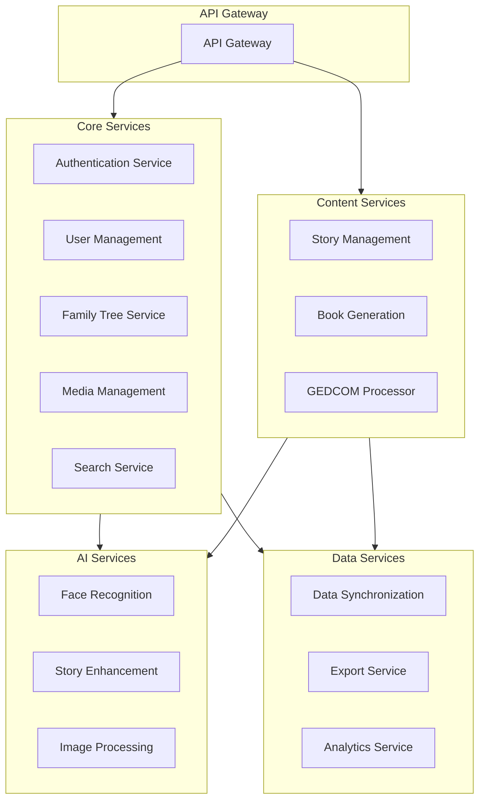

# Microservice Development Prompts

## Core Services

### 1. Authentication Service
```bash
# Development Prompt
Create a Node.js/Express authentication service with the following features:
- User registration and login
- OAuth2 integration (Google, Facebook)
- JWT token management
- Password reset functionality
- MFA support
- Session management
- Rate limiting
- Security logging

Stack:
- Node.js
- Express
- MongoDB
- JWT
- Passport.js
```

### 2. User Management Service
```bash
# Development Prompt
Create a user management service with:
- Profile CRUD operations
- User preferences
- Account settings
- Subscription management
- User activity tracking
- Privacy settings
- Data export capabilities

Stack:
- Python
- FastAPI
- PostgreSQL
- Redis
```

### 3. Family Tree Service
```bash
# Development Prompt
Create a family tree service that handles:
- Family member CRUD operations
- Relationship management
- Tree visualization data
- Family connection suggestions
- Privacy controls
- Sharing permissions
- Version history
- Change tracking

Stack:
- Java
- Spring Boot
- Neo4j
- Elasticsearch
```

### 4. Media Management Service
```bash
# Development Prompt
Create a media management service for:
- Image/document upload
- Thumbnail generation
- Media metadata
- Album organization
- Face detection integration
- Media sharing
- Storage optimization
- Format conversion

Stack:
- Python
- Django
- PostgreSQL
- S3
- Redis
```

## Content Services

### 5. Story Management Service
```bash
# Development Prompt
Create a story management service with:
- Story CRUD operations
- Chapter organization
- Media embedding
- Collaborative editing
- Version control
- Content validation
- Publishing workflow
- Draft management

Stack:
- Node.js
- NestJS
- MongoDB
- Redis
```

### 6. Book Generation Service
```bash
# Development Prompt
Create a book generation service that:
- Generates PDF books
- Handles templates
- Processes images
- Manages layouts
- Supports custom styling
- Handles pagination
- Generates table of contents
- Manages print settings

Stack:
- Python
- FastAPI
- Redis
- LaTeX/WeasyPrint
```

### 7. GEDCOM Processing Service
```bash
# Development Prompt
Create a GEDCOM processing service that:
- Parses GEDCOM files
- Validates data
- Maps to internal format
- Handles different versions
- Manages conflicts
- Generates reports
- Exports data
- Tracks lineage

Stack:
- Python
- FastAPI
- PostgreSQL
- Celery
```

## AI Services

### 8. Face Recognition Service
```bash
# Development Prompt
Create a face recognition service that:
- Detects faces in images
- Creates face embeddings
- Matches similar faces
- Groups related faces
- Suggests tags
- Manages training data
- Handles batch processing

Stack:
- Python
- FastAPI
- Redis
- AWS Rekognition
```

### 9. Story Enhancement Service
```bash
# Development Prompt
Create an AI story enhancement service that:
- Improves writing
- Suggests content
- Generates descriptions
- Adds historical context
- Checks grammar
- Maintains tone
- Manages AI models

Stack:
- Python
- FastAPI
- Redis
- GPT Integration
```

## Data Services

### 10. Data Synchronization Service
```bash
# Development Prompt
Create a data sync service that:
- Manages offline data
- Handles conflicts
- Syncs across devices
- Tracks changes
- Manages versions
- Handles merges
- Ensures consistency

Stack:
- Go
- PostgreSQL
- Redis
- gRPC
```

### 11. Export Service
```bash
# Development Prompt
Create an export service that:
- Generates GEDCOM files
- Creates CSV exports
- Handles PDF generation
- Manages large exports
- Supports various formats
- Handles notifications
- Tracks progress

Stack:
- Python
- FastAPI
- Celery
- S3
```

### 12. Analytics Service
```bash
# Development Prompt
Create an analytics service that:
- Tracks user activity
- Generates reports
- Analyzes usage patterns
- Monitors performance
- Creates visualizations
- Handles data aggregation
- Manages metrics

Stack:
- Python
- FastAPI
- ClickHouse
- Redis
```

## Development Guidelines

### For Each Service:
1. Start with API documentation
2. Create database schema
3. Implement core functionality
4. Add unit tests
5. Add integration tests
6. Implement monitoring
7. Add documentation
8. Create deployment config

### Testing Requirements:
1. Unit test coverage > 80%
2. Integration tests for all APIs
3. Performance tests
4. Security tests
5. Load tests

### Documentation Requirements:
1. API documentation (OpenAPI/Swagger)
2. Setup instructions
3. Development guide
4. Deployment guide
5. Monitoring guide


To get started with development:

1. Choose your first service:
   - Authentication is typically a good starting point
   - Followed by User Management
   - Then Family Tree service

2. For each service:
   a. Set up development environment
   b. Create service skeleton
   c. Implement core features
   d. Add tests
   e. Create deployment pipeline

Would you like me to:
1. Detail the implementation steps for a specific service?
2. Create API specifications for any service?
3. Show how to set up the development environment for a particular stack?
4. Provide database schema designs?

Let me know which aspect you'd like to explore further!
