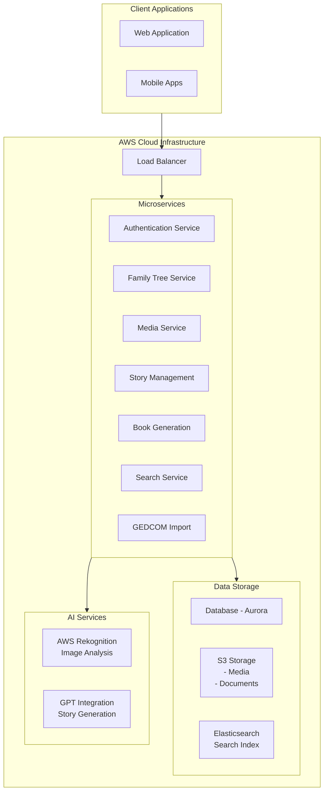

Let's break this project down into phases:

Phase 1: Project Setup and Planning
1. Set up development environment:
   - Install development tools on your MacBook
   - Set up AWS account
   - Install necessary software
   - Set up version control

2. Create project documentation:
   - Technical requirements
   - User stories
   - Database schema
   - API specifications
   - UI/UX wireframes

Phase 2: Core Infrastructure
1. Set up AWS environment:
   - Create Virtual Private Cloud (VPC)
   - Configure security groups
   - Set up monitoring and logging
   - Create development, staging, and production environments

2. Establish CI/CD pipeline:
   - Automated testing
   - Deployment automation
   - Quality checks

Phase 3: Core Features Development
1. Authentication Service:
   - User registration
   - Login/logout
   - Password recovery
   - Social login integration

2. Family Tree Service:
   - Create/edit family members
   - Relationship management
   - Tree visualization
   - GEDCOM import/export

3. Media Service:
   - Photo upload
   - Document storage
   - Media organization
   - Face recognition integration

Phase 4: Advanced Features
1. Story Management System:
   - Story creation interface
   - Chapter organization
   - Media integration
   - Collaborative editing

2. Book Generation:
   - Template management
   - AI-powered story enhancement
   - PDF generation
   - Print integration

3. Search Service:
   - Full-text search
   - Family member search
   - Document search
   - Advanced filters

Would you like me to provide detailed implementation steps for any specific phase? I can also create:
1. A detailed development environment setup guide for your MacBook
2. Step-by-step instructions for setting up the AWS infrastructure
3. Database schema design
4. UI wireframes for key features
5. Specific microservice implementation details

Prompt used:
Build an application for ancestry, better than ancestry.com. This should have all the features that all the ancestry type of application globally available and make those more user friendly. In addition, it should have a feature to print family history as pdf book or document using generative AI. Stories can be added in a CMS portal, and it would sequence the chapters. The book should have ability to add pictures. This should be able to upload GEDCOM compliant files. This should be a cloud native saas solution in aws. Provide step by step prompts to build this application, from documentation, architecture, create an environment in the macbook, list of microservices of features, building independent microservices feature by feature, create the UI for web and mobile, create a step-by-step deployment guide. consider I have never built an application and I am a non-tech person.

